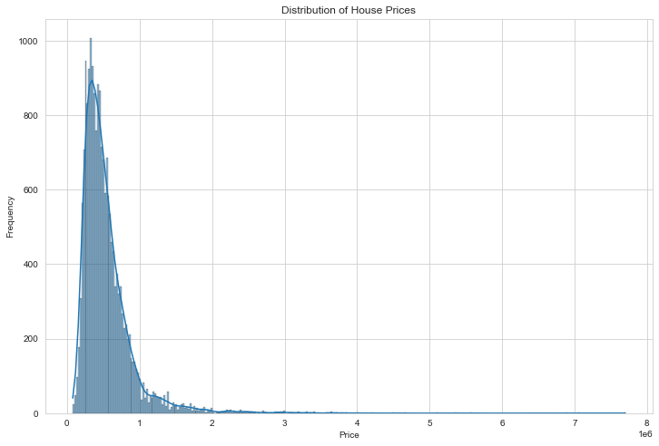
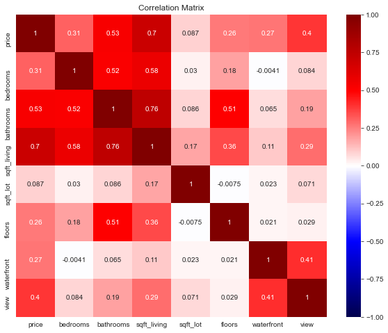
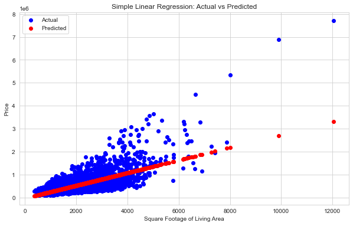

# King County House Sales Price Prediction
## Project Overview
This project focuses on predicting house prices in King County, Washington, using regression modeling. The goal is to provide real estate agents with accurate pricing recommendations for homeowners looking to sell their properties as well as homebuyers looking to get a fair deal. By setting the right price, agents can attract more buyers and ensure a quicker sale.

### Stakeholder

Real Estate Agents: The primary stakeholders who will benefit from accurate pricing recommendations to help homeowners sell their houses quickly and at competitive prices.

Buyers: To understand the fair market value of a house.

Financial Analysts: To assess market trends and property values.

### Objective

To develop a regression model that predicts the sale price of homes based on various features such as square footage, number of bedrooms, bathrooms, location, and other relevant variables.

## Dataset

The project uses the King County House Sales dataset, kc_house_data.csv, which contains the following features:

## Column Names and descriptions for Kings County Data Set
* **id** - unique identified for a house
* **dateDate** - house was sold
* **pricePrice** -  is prediction target
* **bedroomsNumber** -  of Bedrooms/House
* **bathroomsNumber** -  of bathrooms/bedrooms
* **sqft_livingsquare** -  footage of the home
* **sqft_lotsquare** -  footage of the lot
* **floorsTotal** -  floors (levels) in house
* **waterfront** - House which has a view to a waterfront
* **view** - Has been viewed
* **condition** - How good the condition is ( Overall )
* **grade** - overall grade given to the housing unit, based on King County grading system
* **sqft_above** - square footage of house apart from basement
* **sqft_basement** - square footage of the basement
* **yr_built** - Built Year
* **yr_renovated** - Year when house was renovated
* **zipcode** - zip
* **lat** - Latitude coordinate
* **long** - Longitude coordinate
* **sqft_living15** - The square footage of interior housing living space for the nearest 15 neighbors
* **sqft_lot15** - The square footage of the land lots of the nearest 15 neighbors

### Data Limitations

The dataset may have missing values and outliers that could affect the model's accuracy. Additionally, the data is limited to a specific geographic area, which may not generalize well to other locations.

## Project Steps
### Data Collection and Preparation

Loading and cleaning the dataset.
Handling missing values and outliers.
Converting dates and categorical variables to appropriate formats.

Data Limitations
The dataset may have missing values and outliers that could affect the model's accuracy. Additionally, the data is limited to a specific geographic area, which may not generalize well to other locations.

## Exploratory Data Analysis (EDA)

Visualizing the distribution of the target variable (price).

Analyzing relationships between price and key features (e.g., sqft_living, bedrooms, bathrooms).

Key High Correlations:
price:

sqft_living: Strong positive correlation (0.7) — As the square footage of the living area increases, the price tends to increase. bathrooms: Moderate positive correlation (0.53) — Houses with more bathrooms tend to be priced higher.

bedrooms:

bathrooms: Strong positive correlation (0.52) — Houses with more bedrooms often have more bathrooms. sqft_living: Moderate positive correlation (0.58) — More bedrooms are associated with larger living areas.

bathrooms:

sqft_living: Strong positive correlation (0.76) — More bathrooms are typically found in houses with larger living areas.

sqft_living:

bathrooms: Strong positive correlation (0.76) — More bathrooms are typically found in houses with larger living areas. price: Strong positive correlation (0.7) — Larger living areas are associated with higher prices.

## Model Development

linear regression model.
Multiple Linear Regression.

## Business Insights

Provide actionable recommendations to real estate agents on pricing strategies.
Highlight which home features add the most value to the property.

## Deliverables
GitHub Repository: .
Jupyter Notebook: .
Non-technical Presentation: Summarizes the project, key findings, and actionable insights for stakeholders.

# Conclusion

## **Business Conclusions:**

## **Model Performance:**

The Multiple Linear Regression model significantly outperforms the Simple Linear Regression model in terms of both Mean Squared Error (MSE) and R^2 Score.

A lower MSE indicates that the Multiple Linear Regression model has a better fit to the data and makes more accurate predictions.

A higher R^2 score (0.576 compared to 0.503) suggests that the Multiple Linear Regression model explains a greater proportion of the variance in the dependent variable, making it a more reliable model for predicting outcomes.

## **Complexity and Predictive Power:**

The improvement in performance with the Multiple Linear Regression model suggests that incorporating multiple predictors provides a more comprehensive understanding of the factors influencing the target variable.

This implies that the relationship between the predictors and the target variable is likely complex and cannot be captured adequately by a single predictor.

## **Business Implications:**

Multiple Linear Regression model is preferred over the Simple Linear Regression model due to its higher accuracy and better explanatory power.

The model can be used to make more informed and accurate predictions, leading to better strategic decisions.

## **Model Adoption:**

Given the better performance metrics, the business should invest in developing and maintaining the Multiple Linear Regression model.

Training and resources should be allocated to understand and utilize this model effectively, ensuring that the relevant data is continuously updated and the model is regularly evaluated for performance.

